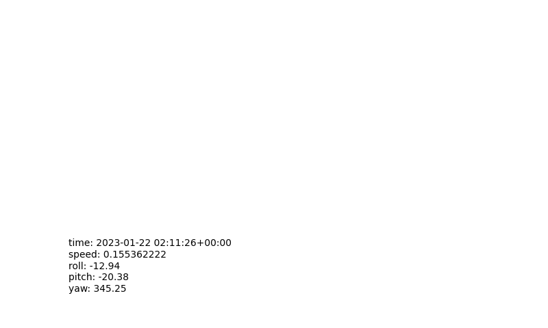

# GPXログからMP4動画を作る

lat, lon の軌跡の動画をMP4で出力する  
rollとspedを棒グラフで出力する  
extentionの内容をテキストで出力する  
別にffmpegが必要

### 動画
`python3 gps_ani.py`を実行
input.gpxを入力してgps.mp4を出力  
`extentions=['yaw', 'pitch', 'roll', 'speed']` に並べたデータをテキストで出力  
`size =10`で文字サイズを指定  
`ratio = 16/9` で指定した縦横比に収まるようにサイズ調整する 0をしていするとアスペクト比を維持しないで画面いっぱいにサイズ調整する
`rotation = 45` で回転角度を指定（度）

変換終了条件は`gps_lib.py`の↓の通り
```
start_speed = 2  # ipoint['speed'] > start_speed となった後に
stop_speed = 0.1 # ipoint['speed'] < stop_speed となると変換を中止する
```
### 静止画
`python3 gps_img.py`を実行
input.gpxを入力してgps.pngを出力  
動画の設定以外にも  
`daxis = "on" # グラフ軸描画の有無 on or off`で枠の出力を指定  

### GPXファイルの例

```
   <trkpt lat="36.533376667" lon="138.334617667">
    <ele>1398.2000</ele>
    <time>2023-01-22T02:11:14.000Z</time>
    <fix>dgps</fix>
    <sat>16</sat>
    <hdop>0.9</hdop>
    <vdop>1.4</vdop>
    <pdop>1.7</pdop>
    <extensions>
    <speed>"0.012346667"</speed>
    <track>"nan"</track>
    <roll>"4.19"</roll>
    <pitch>"0.00"</pitch>
    <yaw>"312.88"</yaw>
    <accl>"0.02, 0.00, 0.00"</accl>
    </extensions>
   </trkpt>
```

